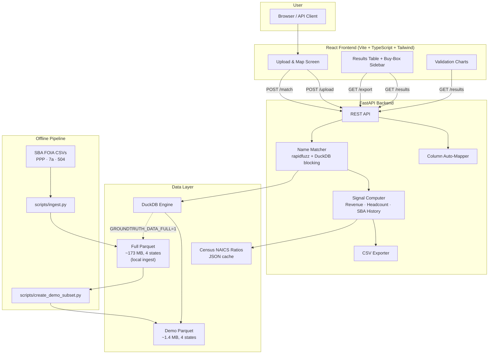
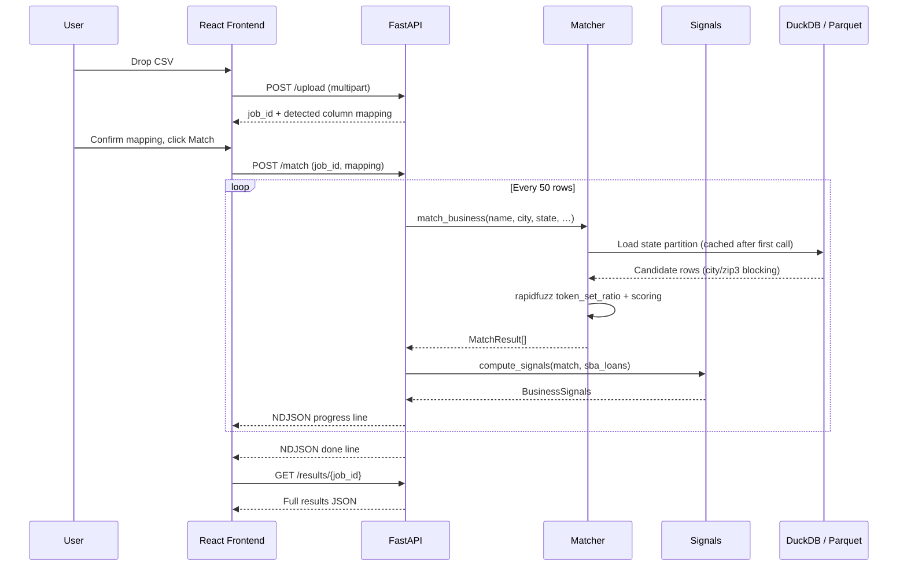

# Architecture

## System Diagram



### Matching Flow



---

## 1. API

**Framework:** FastAPI (Python). Chosen for automatic OpenAPI docs, native async support, and Pydantic validation.

### Endpoints

| Method | Path | Purpose |
|--------|------|---------|
| `POST` | `/upload` | Accepts a multipart CSV file. Returns a `job_id`, detected headers, and an auto-guessed column mapping with confidence levels. |
| `POST` | `/match` | Accepts `job_id` and optional mapping overrides. Streams NDJSON progress events (`{"type": "progress", "completed": N, "total": M}`) every 50 rows, finishing with `{"type": "done", ...}`. |
| `GET` | `/results/{job_id}` | Returns the full match results array for a completed job. |
| `GET` | `/export/{job_id}.csv` | Downloads an annotated CSV with all original columns plus GroundTruth columns (match tier, PPP revenue, headcount, SBA history, recommendation). Streams as `text/csv`. |
| `GET` | `/reference/naics-ratios` | Returns the cached Census NAICS revenue-per-payroll-dollar ratios (JSON). Immutable at runtime — can be served with aggressive `Cache-Control`. |
| `GET` | `/health` | Returns available states, partition counts, and status. Used by Docker health checks and the frontend to show data availability. |

### Streaming Design

The `/match` endpoint uses `StreamingResponse` with `application/x-ndjson`. The frontend reads the stream with `ReadableStream`, updating a progress bar in real time. This avoids HTTP timeouts on large uploads and gives the user immediate feedback. Final results are fetched separately via `/results/{job_id}` to avoid re-parsing the stream.

---

## 2. Data Engine: DuckDB + Parquet

### Why not Postgres?

The workload is **read-only analytical queries over millions of rows** — no inserts, no updates, no transactions, no concurrent writers. This is exactly where columnar storage and an embedded analytical engine outperform a row-oriented RDBMS:

- **Columnar compression.** PPP data has 50+ columns; matching queries touch ~5. Parquet reads only the columns needed. The full 4-state PPP dataset compresses from ~5 GB CSV to ~150 MB Parquet (ZSTD).
- **Partition pruning.** Data is partitioned by `state=XX` directories. A query for California never touches Texas files — DuckDB prunes at the file level before reading a single byte.
- **Zero infrastructure.** DuckDB is an in-process library. No database server, no connection pooling, no migrations, no backups. `pip install duckdb` and read Parquet directly.
- **Demo-friendly.** The 1.4 MB demo Parquet ships inside the git repo. Clone → run. No database setup step.

### When to switch

If GroundTruth moved to a multi-user SaaS model with concurrent uploads, persistent user accounts, and write-heavy job queues, the right move would be Postgres for job state and user data, keeping DuckDB (or ClickHouse) for the analytical matching layer. The Parquet files on object storage (R2/S3) would remain the source of truth for loan data.

---

## 3. Application State

### Current: In-Process Dict

Job metadata, uploaded CSV content, and match results live in a Python `dict` keyed by `job_id`. This is:

- **Zero-ops:** no database to provision, migrate, or back up.
- **Fast:** no serialization overhead for intermediate results.
- **Appropriate for a demo:** single-process, single-user, ephemeral state.

### Under Load: Postgres + Redis

For production with multiple users and workers:

| Concern | Solution |
|---------|----------|
| Job persistence | Postgres via SQLModel (already a dependency) |
| Job queue / async matching | Redis + Celery or `arq` |
| File storage | Uploaded CSVs to object storage (R2/S3), not in-memory |
| Result caching | Redis with TTL, or Postgres JSONB column |
| Horizontal scaling | Multiple Uvicorn workers behind a load balancer; stateless API servers |

---

## 4. Caching Strategy

Three layers, each serving a different purpose:

1. **Parquet is the cache.** The ingest pipeline runs once offline, converting CSV → Parquet with ZSTD compression. This is a materialized, pre-indexed view of the raw data. The app never touches CSV at runtime.

2. **In-process state data.** When a state is first queried, `_load_ppp_state()` reads all Parquet files for that state into a Python dict indexed by city name and 3-digit zip prefix. Subsequent queries for the same state hit memory. With the demo subset (~5K rows/state), this loads in <0.5s and uses ~10 MB RAM per state.

3. **NAICS ratios — static JSON.** `data/reference/census_ratios_2022.json` is loaded once on first use and held in a module-level variable. The `/reference/naics-ratios` endpoint can be served with `Cache-Control: public, max-age=86400` since the data changes only when someone re-runs the Census fetch script.

---

## 5. Hosting Plan

| Component | Host | Rationale |
|-----------|------|-----------|
| **Frontend** (static React build) | Vercel or Cloudflare Pages | Free tier, global CDN, automatic deploys from GitHub |
| **Backend** (FastAPI container) | Fly.io or Railway | Container hosting with ~256 MB RAM is sufficient for demo; both offer free/hobby tiers |
| **Demo data** (1.4 MB Parquet) | Bundled in Docker image | No external dependency; clone-and-run |
| **Full data** (production) | Cloudflare R2 (S3-compatible) | Free egress; DuckDB can read Parquet from S3 via `httpfs` extension |

### Local Development

```bash
# Backend
pip install -r requirements.txt
uvicorn groundtruth.api:app --reload --port 8000

# Frontend
cd frontend && npm install && npm run dev

# Or with Docker
docker-compose up
```

---

## 6. Deployment

### GitHub Actions Workflow

On push to `main`:

1. **Test job:** Install Python deps, run `pytest`. Install Node deps, run `tsc --noEmit` and `vite build`.
2. **Build job** (on test success): Build Docker image with multi-stage Dockerfile (Python backend + pre-built React static files).
3. **Deploy job:** Push image to Fly.io registry (`flyctl deploy`) or Railway (`railway up`). Frontend static files deploy to Vercel/Cloudflare Pages via their GitHub integration (no custom workflow needed).

The Dockerfile uses multi-stage builds:
- Stage 1: Install Python dependencies
- Stage 2: Build React frontend (`npm ci && npm run build`)
- Stage 3: Final image with Python runtime, backend code, built frontend, and demo Parquet data

---

## 7. Performance

### Benchmark Results

Measured with `scripts/bench.py` against the demo subset (4 states, ~15K PPP rows + ~7K SBA rows):

| Metric | Value |
|--------|-------|
| Throughput | **70 rows/sec** |
| 100 rows | 1.43s |
| 1000 rows (projected) | **14.3s** |
| Target (1000 rows < 60s) | **PASS** |
| Match rate (demo subset) | 45% |

The first query per state pays a ~0.3s load penalty (reading Parquet into memory). Subsequent queries for the same state hit the in-process cache.

Against the full dataset (3.3M PPP rows), the per-row query approach via DuckDB takes ~3.9 rows/s without caching. The in-process cache strategy brings this to acceptable levels but requires more RAM (~500 MB for CA alone). For production scale, the right approach would be a DuckDB persistent database with indexes, or pre-built inverted indexes on normalized names.

---

## 8. Resilience

### Source URL Verification

All SBA data source URLs are stored in `config/sources.yaml` rather than hardcoded. The SBA occasionally renames files when publishing new quarterly releases.

```bash
python scripts/check_sources.py
```

This sends HEAD requests to every URL in the config and reports failures. Run it before a fresh ingest to catch renamed files early.

### Data Vintage

PPP data is frozen (last modified October 2024). SBA 7(a)/504 data refreshes quarterly. The ingest script is idempotent — re-running with existing files skips downloads and re-processes from CSV.

---

## 9. Data Pipeline

### Full Ingest (`scripts/ingest.py`)

```
SBA FOIA CSVs (13 PPP + 3 7(a) + 1 504)
    ↓ curl download to data/raw/
    ↓ DuckDB reads CSV
    ↓ Select only needed columns
    ↓ Drop protected columns (Race, Ethnicity, Gender, Veteran)
    ↓ Add normalized_name via UDF
    ↓ Write Parquet partitioned by BorrowerState
    → data/processed/ppp/state=CA/*.parquet
    → data/processed/sba7a/state=CA/*.parquet
    → data/processed/sba504/state=CA/*.parquet
```

Supports `--states CA,TX` to limit processing. Full 4-state ingest takes ~20 seconds on an M-series Mac.

### Demo Subset (`scripts/create_demo_subset.py`)

Samples ~5K PPP rows and ~2K SBA rows per state, biased toward cities present in the sample CSV. Output: `data/demo/` at ~1.4 MB total, committed to git so the app works immediately after clone.

### Switching Between Demo and Full Data

The matching module checks for `data/demo/` first, falling back to `data/processed/`. Set `GROUNDTRUTH_DATA_FULL=1` to force the full dataset when both exist.
