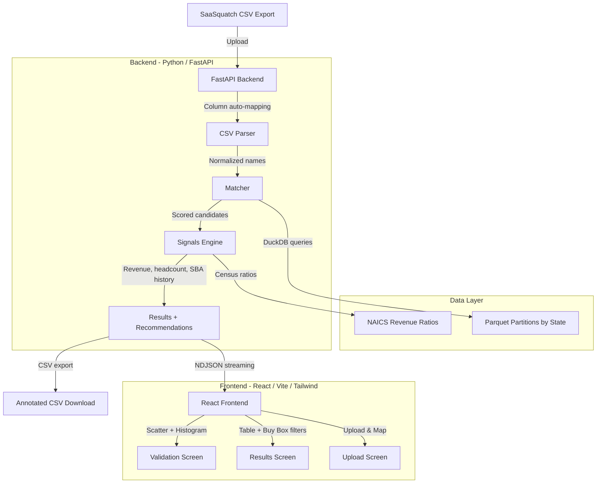

# GroundTruth for SaaSquatch

GroundTruth is a plug-in validation layer that sits on top of SaaSquatch's CSV export. Upload your export, and it matches each company against federal PPP and SBA loan records to return government-anchored revenue estimates, headcount, business age, franchise status, and SBA borrowing history. The result: you know which leads deserve an enrichment credit before you spend one.

## The problem

SaaSquatch pulls from Apollo, LinkedIn, Crunchbase, and Growjo — sources that skew toward tech and funded companies. Acquisition searchers buy HVAC shops, dental practices, landscapers, trucking firms, and machine shops: businesses that are nearly invisible in those databases. SaaSquatch can only *estimate* their revenue with a model.

Meanwhile, the U.S. government published loan-level records for millions of exactly these businesses through the PPP and SBA 7(a)/504 programs. Each PPP loan encodes a near-exact payroll figure (loans were sized at 2.5x average monthly payroll). Combined with Census industry ratios, that payroll figure anchors a revenue estimate to what the business told the federal government — not what a model guessed.

GroundTruth checks SaaSquatch's estimate against that anchor and tells you which credits you are about to waste.

## Quickstart (60 seconds)

```bash
# Clone and set up
git clone <repo-url> && cd caprae
python3 -m venv .venv && source .venv/bin/activate
pip install -r requirements.txt

# Demo data is already included (~1.4 MB Parquet subset for CA, TX, FL, AZ).
# To ingest the full dataset (~11.5M rows, several GB):
#   python scripts/ingest.py --states CA,TX,FL,AZ

# Start the backend
uvicorn groundtruth.api:app --reload --port 8000

# In another terminal, start the frontend
cd frontend && npm install && npm run dev
```

Open http://localhost:5173, upload `data/samples/saasquatch_export_sample.csv`, and click Match.

## What I deliberately didn't build, and why

| Feature | Why not |
|---|---|
| 0-100 lead score | SaaSquatch already has AI company scoring |
| Hot / Warm / Cold tiers | Already built into SaaSquatch |
| Email generator | SaaSquatch has an AI email generator |
| MX email validation | SaaSquatch has email validators |
| CRM pipeline board | SaaSquatch has team and workflow features |
| LinkedIn messenger | Already in SaaSquatch |
| "AI-powered" anything in UI copy | The value here is *government data*, not another model |

Nearly every public submission for this challenge rebuilds one of the above. That signals the candidate didn't study the product. GroundTruth fills a gap that SaaSquatch's current data sources cannot cover.

## Data sources

All data is U.S. Government Works and in the public domain.

| Source | Description | License |
|---|---|---|
| [PPP FOIA (SBA)](https://data.sba.gov/dataset/ppp-foia) | ~11.5M loan-level records from the Paycheck Protection Program, including borrower name, address, loan amount, payroll proceeds, NAICS code, and jobs reported. Last modified Oct 2024. | Public domain |
| [7(a) & 504 FOIA (SBA)](https://data.sba.gov/dataset/7a-504-foia) | SBA 7(a) and 504 loan records with borrower details, approval amounts, terms, lender info, and loan status. Refreshed quarterly. | Public domain |
| [2022 Economic Census (Census Bureau)](https://api.census.gov/data/2022/ecnbasic.html) | Annual payroll and revenue by NAICS code, used to compute industry-specific payroll-to-revenue ratios. Cached locally. | Public domain |

## Ethics

- **Business-level data only.** All records describe businesses, not individuals.
- **Demographic fields dropped at ingest.** The PPP dataset includes `Race`, `Ethnicity`, `Gender`, and `Veteran` columns. These are excluded from the pipeline at the earliest stage (`scripts/ingest.py`) and never stored, queried, or displayed.
- **No scraping of SaaSquatch.** GroundTruth does not access, log into, or automate the SaaSquatch platform. It operates exclusively on the user's own CSV export.
- **Respects SaaSquatch ToS.** The tool is a companion layer, not a replacement. It adds public-record context to data the user already has.

## Limitations

- **2020-21 vintage.** PPP loans were issued in 2020-2021. Payroll and revenue figures reflect that period. An optional CPI inflation slider is available in the UI but is clearly labeled as a user adjustment, not data.
- **Coverage.** Only businesses that received a PPP or SBA loan appear in the dataset. Businesses that did not apply or were not approved will show as "No match."
- **Probabilistic matching.** Name matching uses normalized text comparison (rapidfuzz token-set ratio) with city/zip/address blocking. Confidence tiers (High / Probable / Weak) and plain-English match reasons are shown for every result. Weak matches are excluded from revenue calculations by default.
- **Revenue is an estimate.** The payroll-to-revenue ratio varies within NAICS codes. GroundTruth shows a range using ratios at different NAICS specificity levels and labels the formula used.

## Benchmark

Measured against the 4-state demo partition (~15K PPP rows, ~6K SBA rows):

| Metric | Value |
|---|---|
| Throughput | 70 rows/s |
| 100-row run | 1.4s |
| 1,000-row estimate | 14.3s |
| Target (< 60s) | **PASS** |

Run it yourself:

```bash
python scripts/bench.py 100
```

## Architecture



| Layer | Technology | Why |
|---|---|---|
| API | FastAPI | Async streaming (NDJSON progress), automatic OpenAPI docs, type hints |
| Data engine | DuckDB + Parquet | Columnar format with partition pruning by state. Read-heavy workload on 10M+ rows with no writes — a better fit than Postgres for this shape |
| App state | In-process dict | Zero-ops for a demo. Under production load, swap to SQLite (via SQLModel) or Postgres |
| Cache | In-memory LRU per state; Census ratios pre-cached as JSON; Parquet is itself the cache | No runtime dependency on external APIs |
| Frontend | React + Vite + TypeScript + Tailwind | Fast dev iteration, type safety, utility-first styling |
| Charts | Recharts | Lightweight, React-native, sufficient for scatter + histogram |

### API endpoints

| Method | Path | Description |
|---|---|---|
| `POST` | `/upload` | Upload CSV, returns detected column mapping + job ID |
| `POST` | `/match` | Run matching, streams NDJSON progress |
| `GET` | `/results/{job_id}` | Full match results as JSON |
| `GET` | `/export/{job_id}.csv` | Download annotated CSV with all computed columns |
| `GET` | `/reference/naics-ratios` | Census payroll-to-revenue ratios |
| `GET` | `/health` | Health check with available states and partition counts |

### Running with Docker

```bash
docker-compose up
```

Backend on port 8000, frontend on port 5173.

### Full data ingest

The repo ships a ~1.4 MB demo subset. To ingest the full PPP + SBA dataset:

```bash
python scripts/ingest.py --states CA,TX,FL,AZ
# Set GROUNDTRUTH_DATA_FULL=1 to use the full dataset at runtime
```

### Census API key

The Census Bureau API now requires a free API key. The cached ratios file (`data/reference/census_ratios_2022.json`) is committed and used at runtime. To refresh:

```bash
python scripts/fetch_census.py --api-key YOUR_KEY
```
